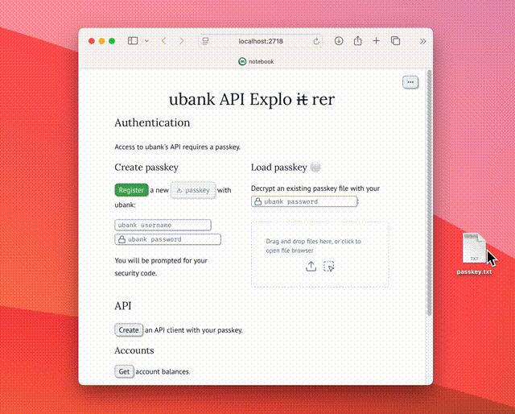

# ubank

Access [ubank](https://www.ubank.com.au)'s API using Python.


## Getting started

Install ubank using pip:

    pip install ubank

The ubank package provides a script to register a new passkey with ubank:

```console
$ ubank name@domain.com --output passkey.txt
Enter ubank password:
Enter security code sent to 04xxxxx789: 123456
```

This saves a new passkey to `passkey.txt` (encrypted with your ubank password).
You'll be prompted for your ubank username and SMS security code interactively.

> [!CAUTION]
> Your passkey grants access to your bank account.
> It is **your** responsibility to keep it safe!

Create a script named `balances.py`:

```python
from getpass import getpass

from ubank import Client, Passkey

# Load passkey from file.
with open("passkey.txt", "rb") as f:
    passkey = Passkey.load(f, password=getpass("Enter ubank password: "))

# Print account balances.
with Client(passkey) as client:
    for account in client.get_linked_banks().linkedBanks[0].accounts:
        print(
            f"{account.label} ({account.type}): {account.balance.available} {account.balance.currency}"
        )
```

Run the script to print your account balances:

```console
$ python balances.py
Enter ubank password:
Spend account (TRANSACTION): 765.48 AUD
Savings account (SAVINGS): 1577.17 AUD
```


## Contents

- [Getting started](#getting-started)
- [Contents](#contents)
- [ubank CLI](#ubank-cli)
- [ubank API client](#ubank-api-client)
- [Example web application](#example-web-application)
- [How to set up a development environment](#how-to-set-up-a-development-environment)
- [How to test](#how-to-test)
- [How to publish a new release](#how-to-publish-a-new-release)
- [Changelog](#changelog)


## ubank CLI

The `ubank` module provides a CLI for registering a new passkey:

```console
$ ubank --help
usage: ubank [-h] [-o FILE] [-n PASSKEY_NAME] [-v] username

Returns a new passkey registered with ubank.

positional arguments:
  username              ubank username

options:
  -h, --help            show this help message and exit
  -o, --output FILE     writes encrypted passkey to file (default: write to stdout)
  -n, --passkey-name PASSKEY_NAME
                        sets passkey name (default: ubank.py)
  -v, --verbose         displays httpx INFO logs

You will be asked for your ubank password and secret code interactively. The passkey is encrypted with your ubank password.
```


## ubank API client

Create an instance of `ubank.Client` to access ubank's API:

```python
from datetime import date
from getpass import getpass

from ubank import Client, Filter, Passkey

with open("passkey.txt", "rb") as f:
    passkey = Passkey.load(f, password=getpass("Enter ubank password: "))

with Client(passkey) as client:
    client.summarise_transactions(
        body=Filter(fromDate=date(2025, 1, 1), toDate=date(2025, 2, 1))
    )
    bank = client.get_linked_banks().linkedBanks[0]
    client.search_account_transactions(
        account_id=bank.accounts[0].id,
        bank_id=bank.bankId,
        customerId=client.get_customer_details().customerId,
    )
    client.get_cards()
    client.get_devices(deviceUuid=passkey.device_id)
    client.get_contacts()
```


## Example web application

`notebook.py` is a [marimo notebook](https://eidorb.github.io/ubank/notebook.html).
It demonstrates usage of the API client class to explore ubank's API.

Open `notebook.py` in the marimo editor:

    uv run marimo edit notebook.py

Run the notebook as a web application:

    uv run marimo edit notebook.py




## How to set up a development environment

Install [uv](https://docs.astral.sh/uv/):

    curl -LsSf https://astral.sh/uv/install.sh | sh

Clone this repository:

    git clone git@github.com:eidorb/ubank.git
    cd ubank

uv ensures Python dependencies compatible with those defined in [`pyproject.toml`](pyproject.toml)
are automatically installed:

```console
$ uv run python -c 'import ubank; print(ubank.__version__)'
Using CPython 3.13.2 interpreter at: /opt/homebrew/opt/python@3.13/bin/python3.13
Creating virtual environment at: .venv
Installed 17 packages in 22ms
2.0.0
```


## How to test

Run all tests:

    uv run -m pytest -v


## How to publish a new release

Bump project version with [hatch](https://hatch.pypa.io/latest/version/):

```console
$ uvx hatch version release
Old: 2.0.0rc2
New: 2.0.0
```

Update `test_version` test.

Create version tag and push to GitHub:

    git tag "v$(uvx hatch version)"
    git push origin "v$(uvx hatch version)"

Open new release form for tag:

    open "https://github.com/eidorb/ubank/releases/new?tag=v$(uvx hatch version)"

Publishing a release triggers this [workflow](.github/workflows/workflow.yml)
which builds and publishes the package to [PyPI](https://pypi.org/project/ubank/).

If you screw up -- delete local and remote tags and have another go:

    git tag -d "v$(uvx hatch version)"
    git push origin --delete "v$(uvx hatch version)"


## Changelog

### 2.2.2

- Fix potentially optional Transaction fields (thanks [@CactiNotch](https://github.com/CactiNotch)!)


### 2.2.1

- `get_linked_banks()` returns linked external bank accounts (thanks [@CactiNotch](https://github.com/CactiNotch)!)


### 2.2.0

- Rework API method and model names to have more meaning


### 2.1.0

- Passkey encrypted with ubank password
- Add API client `Api`
- Add marimo notebook


### 2.0.0

- Implement passkey registration and authentication (fixes [#6](https://github.com/eidorb/ubank/issues/6)).
- Automate releases.
- Support Python 3.9+.
- Migrate from Poetry to uv.


### 1.1.0

- Set `x-api-version` to fix [#4](https://github.com/eidorb/ubank/issues/4) (thanks [@jakepronger](https://github.com/jakepronger)!)


### 1.0.0

- Drop Playwright requirement.
- Re-implement with simpler and lightweight [httpx](https://www.python-httpx.org) libary.
- Easier access to full ubank API.


### 0.1.2

- Automate ubank access using [Playwright](https://playwright.dev) headless browser.
